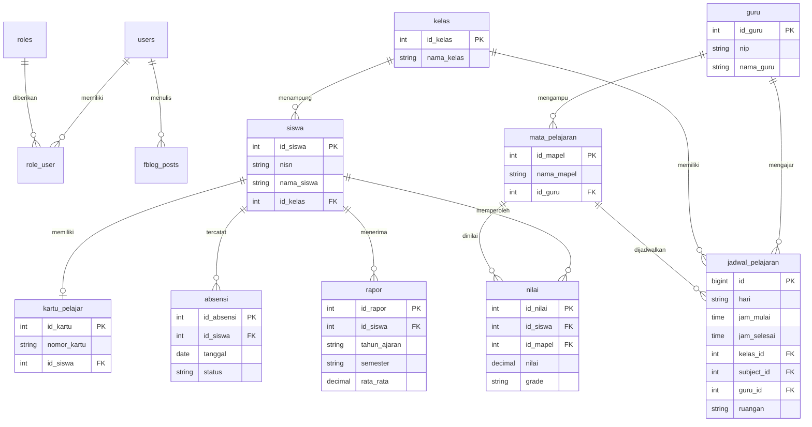

# Entity Relationship Diagram

ERD ini berfokus pada tabel bisnis utama SIAKAD. Tabel teknis Laravel untuk autentikasi, session, cache, queue, role, dan tabel internal Filament Blog tetap digunakan oleh aplikasi.

